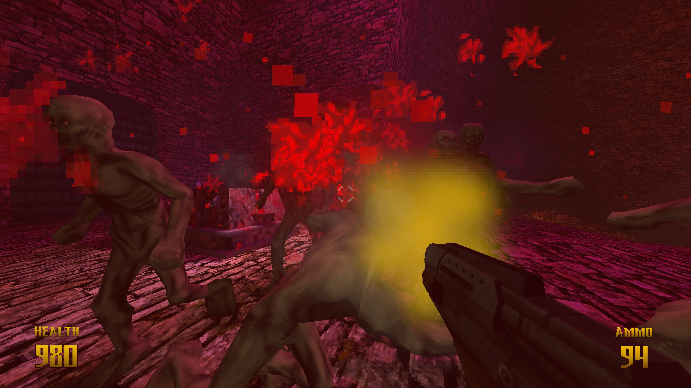

# FPS Prototype

----



[Download Executable](https://quenchgames.itch.io/fps-mechanics-prototype)

This document is to serve as a technical documentation for the project.

### Features

- Modular AI System
- Smooth Quake like movement with strafe jumping
- Two weapons, swappable, with ammo
- Trigger System Where Events Open Gates
- Bullet Spread Visualizer Inspector
- Crunchy Particle Effects
- Camera Bob on Walk, Take Damage, and Landing
- Level Complete Screen With Accuracy Calculation

### Modular AI System
I had tried a few AI assets from the store and found them to have various bugs that caused my enemies to act with strange behaviours, especially during state transitions. I decided to take inspiration from them and create my own.

The high level overview of the system is as follows:

1. Implement Behaviors For Each State
   - We define an enum that contains possible states for an AI type.
   - For each behavior we create a class that derives from `AIStateBehavior<PossibleStatesEnum>` where possible states is the enum defined in step 1. This essentially makes our class useable by a wrapping StateMachine.
   - In this class we program the behavior of our AI. `Awake` is replaced with `AwakeStateController`, but functions the same. This is because the parent class uses Awake for some initialization into its state machine.
   - Each behavior controls transitions to other states, calling `stateMachine.TransitionToState(THE_STATE)`
  
2. Implement a `BehaviorStateManager`. In this project the example of this class is the `MeleeEnemyController`. It also needs a Type argument which should match the Enum that the behaviors were defined with. This allows the Controller to be compatible with the AIStateBehaviors.
   - In here, you override the abstract `TransitionToState()` method that is called by children StateBehaviors, and define what happens during transition. In the example `MeleeEnemyController` class, we call...
      - **ExitState()** - This method is part of the abstract `AIStateBehavior` which was overriden by the implementing class. This is so the behavior can do something on exit of its own State.
      - Update the currentState of the `MeleeEnemyController`.
      - **EnterState()** - Call on the new state.
      - Disable the old StateBehavior.
      - Enable the new StateBehavior.
    - This class also defines other non-state related behaviors such as executing footstep audio and handling damage effects.
3. Blend trees were not used for this. I have often found that calling animator changes manually through code is more simple and flexible for basic conditions.

### Quake Like Movement
This project implements the same velocity calculation algorithm as Quake 1, and so strafe jumping is possible.

### Weapon System
The weapon system is pretty basic. Each weapon is added under a root "Weapon Manager". The Weapon manager tracks what weapons the player has avaiable. The player "requests" a weapon by pressing a number key. If the player has the requested weapon the Weapon Manager disables the current weapon and enables the new one. An animation is played OnEnable and OnDisable for the guns.

### Trigger System
Trigger System (a basic event system) was put in place as an easy to use mechanism for tying object behavior to game events. It works as follows:
1. A Singleton TriggerManager exists in the scene. It detects all ITriggerListeners and saves a reference to them.
2. Because it is a Singleton it can be globally accessed and triggers can be called like this: `TriggerManager.CallTrigger(triggerName)`
3. GameObjects that implement ITriggerListener will need to implement an `OnTrigger(triggerName)` method.
4. A utility `ScriptableObject` called `Trigger` can be used to solve the problem of decoupled triggerNames.

Here is an example:
```cs
// Attach this to any door, create a new Trigger via Right Click -> Create Trigger. Assign the resource a name. Link that resource to the TriggerToListenTo variable here.
public class DoorTriggerListener implements ITriggerListener
{
  // Scriptable object that is createable from the RightClick context menu.
  [Required] public Trigger TriggerToListenTo;

  void OnTrigger(triggerName)
  {
    if (TriggerToListenTo.Is(triggerName))
    {
      OpenDoor();
    }
  }

  void OpenDoor() { ...open door logic }
}

public class AreaTrigger
{
  // Link the same Trigger resource as above into this component, and they will now work together!
  public Trigger TriggerToEmit;
  
  private void OnTriggerEnter(Collider other) 
  {
      if (GameObjectHelper.IsPlayer(other.gameObject))
      {
          TriggerToEmit.Emit();
      }
  }
}
```

### Bullet Spread Visualizer Inspector


I wanted a way to visualize a bullet spread pattern given a set of vertices. This tool was implemented to help with that, and I found this very useful. It only visualizes the defined points, and is not editable in a way where you can click and drag the points. But its current behavior is intuitive enough that implementing draggable dots would be overkill.
